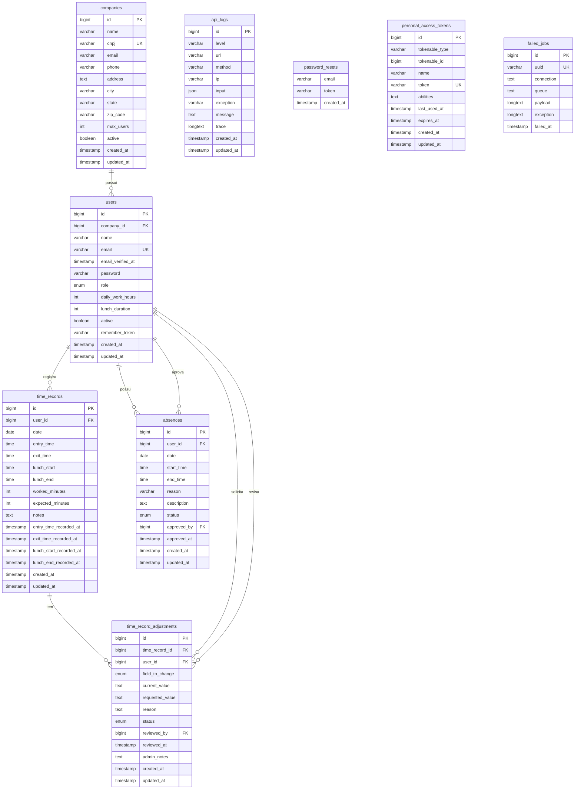

# 🗄️ Diagrama do Banco de Dados - Sistema de Ponto

## 📊 Diagrama Visual Completo



## 🔑 Relacionamentos

### 1️⃣ Companies → Users (1:N)
```
companies.id ←→ users.company_id
CASCADE ON DELETE
```
Uma empresa possui múltiplos usuários (NULL para usuários Master)

### 2️⃣ Users → Time Records (1:N)
```
users.id ←→ time_records.user_id
CASCADE ON DELETE
```
Um usuário possui múltiplos registros de ponto

### 3️⃣ Users → Absences (1:N)
```
users.id ←→ absences.user_id
CASCADE ON DELETE
```
Um usuário possui múltiplas ausências

### 4️⃣ Users → Absences [Aprovador] (1:N)
```
users.id ←→ absences.approved_by
SET NULL ON DELETE
```🏢 COMPANIES
Armazena empresas/organizações do sistema

| Coluna | Tipo | Descrição | Constraints |
|--------|------|-----------|-------------|
| `id` | BIGINT | Identificador único | PK, AUTO_INCREMENT |
| `name` | VARCHAR | Nome da empresa | NOT NULL |
| `cnpj` | VARCHAR(14) | CNPJ sem pontuação | UNIQUE, NOT NULL |
| `email` | VARCHAR | Email da empresa | NULL |
| `phone` | VARCHAR(20) | Telefone | NULL |
| `address` | TEXT | Endereço completo | NULL |
| `city` | VARCHAR(100) | Cidade | NULL |
| `state` | VARCHAR(2) | UF (sigla) | NULL |
| `zip_code` | VARCHAR(8) | CEP sem pontuação | NULL |
| `max_users` | INT | Limite de usuários | DEFAULT 50 |
| `active` | BOOLEAN | Empresa ativa | DEFAULT true |
| `created_at` | TIMESTAMP | Data de criação | NULL |
| `updated_at` | TIMESTAMP | Data de atualização | NULL |

**Índices:**
- PRIMARY KEY: `id`
- UNIQUE: `cnpj`
- INDEX: `cnpj`
- INDEX: `active`

---

### 👤 USERS
Armazena usuários do sistema (Master, Admin, Funcionários)

| Coluna | Tipo | Descrição | Constraints |
|--------|------|-----------|-------------|
| `id` | BIGINT | Identificador único | PK, AUTO_INCREMENT |
| `company_id` | BIGINT | ID da empresa | FK → companies.id, NULL para Master |
| `name` | VARCHAR | Nome completo | NOT NULL |
| `email` | VARCHAR | Email de acesso | UNIQUE, NOT NULL |
| `email_verified_at` | TIMESTAMP | Data verificação email | NULL |
| `password` | VARCHAR | Senha criptografada | NOT NULL |
| `role` | ENUM | Nível de acesso | DEFAULT 'user' |
| `daily_work_hours` | INT | Horas trabalho/dia | DEFAULT 8 |
| `lunch_duration` | INT | Duração almoço (min) | DEFAULT 60 |
| `active` | BOOLEAN | Usuário ativo | DEFAULT true |
| `remember_token` | VARCHAR | Token de sessão | NULL |
| `created_at` | TIMESTAMP | Data de criação | NULL |
| `updated_at` | TIMESTAMP | Data de atualização | NULL |

**Valores ENUM role:**
- `master` - Super administrador (acesso total, sem empresa)
- `admin` - Administrador da empresa (gerencia usuários e solicitações)
- `user` - Funcionário comum (registra ponto e solicita ajustes)

**Índices:**
- PRIMARY KEY: `id`
- UNIQUE: `email`
- INDEX: `company_id`
- INDEX: `(company_id, role)`

**Foreign Keys:**
- `company_id` → `companies.id` ON DELETE CASCADEE
```
Um administrador pode revisar múltiplas solicitações

---

## 📋 Tabelas Detalhadas

### 👤 USERS
Armazena funcionários e administradores do sistema

| Coluna | Tipo | Descrição | Constraints |
|--------|------|-----------|-------------|
| `id` | BIGINT | Identificador único | PK, AUTO_INCREMENT |
| `name` | VARCHAR | Nome completo | NOT NULL |
| `email` | VARCHAR | Email de acesso | UNIQUE, NOT NULL |
| `email_verified_at` | TIMESTAMP | Data verificação email | NULL |
| `password` | VARCHAR | Senha criptografada | NOT NULL |
| `role` | VARCHAR | Papel (admin/user) | DEFAULT 'user' |
| `daily_work_hours` | INT | Horas trabalho/dia | DEFAULT 8 |
| `lunch_duration` | INT | Duração almoço (min) | DEFAULT 60 |
| `active` | BOOLEAN | Usuário ativo | DEFAULT true |
| `remember_token` | VARCHAR | Token de sessão | NULL |
| `created_at` | TIMESTAMP | Data de criação | NULL |
| `updated_at` | TIMESTAMP | Data de atualização | NULL |

**Índices:**
- PRIMARY KEY: `id`
- UNIQUE: `email`

---

### ⏰ TIME_RECORDS
Registros diários de ponto dos funcionários

| Coluna | Tipo | Descrição | Constraints |
|--------|------|-----------|-------------|
| `id` | BIGINT | Identificador único | PK, AUTO_INCREMENT |
| `user_id` | BIGINT | ID do funcionário | FK → users.id |
| `date` | DATE | Data do registro | NOT NULL |
| `entry_time` | TIME | Horário de entrada | NULL |
| `exit_time` | TIME | Horário de saída | NULL |
| `lunch_start` | TIME | Início do almoço | NULL |
| `lunch_end` | TIME | Fim do almoço | NULL |
| `worked_minutes` | INT | Minutos trabalhados | DEFAULT 0 |
| `expected_minutes` | INT | Minutos esperados | DEFAULT 480 |
| `notes` | TEXT | Observações | NULL |
| `entry_time_recorded_at` | TIMESTAMP | Quando registrou entrada | NULL |
| `exit_time_recorded_at` | TIMESTAMP | Quando registrou saída | NULL |
| `lunch_start_recorded_at` | TIMESTAMP | Quando registrou início almoço | NULL |
| `lunch_end_recorded_at` | TIMESTAMP | Quando registrou fim almoço | NULL |
| `created_at` | TIMESTAMP | Data de criação | NULL |
| `updated_at` | TIMESTAMP | Data de atualização | NULL |

**Índices:**
- PRIMARY KEY: `id`
- UNIQUE: `(user_id, date)` - Um registro por usuário/dia
- INDEX: `date`
- INDEX: `(user_id, date)`

**Foreign Keys:**
- `user_id` → `users.id` ON DELETE CASCADE

---� TIME_RECORD_ADJUSTMENTS
Solicitações de ajuste de registros de ponto

| Coluna | Tipo | Descrição | Constraints |
|--------|------|-----------|-------------|
| `id` | BIGINT | Identificador único | PK, AUTO_INCREMENT |
| `time_record_id` | BIGINT | ID do registro de ponto | FK → time_records.id |
| `user_id` | BIGINT | ID do solicitante | FK → users.id |
| `field_to_change` | ENUM | Campo a ser alterado | NOT NULL |
| `current_value` | TEXT | Valor atual | NULL |
| `requested_value` | TEXT | Novo valor solicitado | NOT NULL |
| `reason` | TEXT | Justificativa | NOT NULL |
| `status` | ENUM | Status da solicitação | DEFAULT 'pending' |
| `reviewed_by` | BIGINT | ID do revisor | FK → users.id |
| `reviewed_at` | TIMESTAMP | Data da revisão | NULL |
| `admin_notes` | TEXT | Observações do admin | NULL |
| `created_at` | TIMESTAMP | Data de criação | NULL |
| `updated_at` | TIMESTAMP | Data de atualização | NULL |

**Valores ENUM field_to_change:**
- `entry_time` - Horário de entrada
- `exit_time` - Horário de saída
- `lunch_start` - Início do almoço
- `lunch_end` - Fim do almoço
- `date` - Data do registro
- `notes` - Observações

**Valores ENUM status:**
- `pending` - Aguardando revisão
- `approved` - Aprovada pelo admin
- `rejected` - Rejeitada pelo admin

**Índices:**
- PRIMARY KEY: `id`
- INDEX: `time_record_id`
- INDEX: `user_id`
- INDEX: `status`
- INDEX: `(user_id, status)`
- INDEX: `(time_record_id, status)`
- INDEX: `reviewed_by`

**Foreign Keys:**
- `time_record_id` → `time_records.id` ON DELETE CASCADE
- `user_id` → `users.id` ON DELETE CASCADE
- `reviewed_by` → `users.id` ON DELETE SET NULL

---

### �

### 🏥 ABSENCES
Ausências dos funcionários (faltas, atestados, férias)

| Coluna | Tipo | Descrição | Constraints |
|--------|------|-----------|-------------|
| `id` | BIGINT | Identificador único | PK, AUTO_INCREMENT |
| `user_id` | BIGINT | ID do funcionário | FK → users.id |
| `date` | DATE | Data da ausência | NOT NULL |
| `start_time` | TIME | Horário de início | NOT NULL |
| `end_time` | TIME | Horário de fim | NOT NULL |
| `reason` | VARCHAR | Motivo | NOT NULL |
| `description` | TEXT | Descrição detalhada | NULL |
| `status` | ENUM | Status da ausência | DEFAULT 'pending' |
| `approved_by` | BIGINT | ID do aprovador | FK → users.id |
| `approved_at` | TIMESTAMP | Data de aprovação | NULL |
| `created_at` | TIMESTAMP | Data de criação | NULL |
| `updated_at` | TIMESTAMP | Data de atualização | NULL |

**Valores ENUM status:**
- `pending` - Aguardando aprovação
- `approved` - Aprovada
- `rejected` - Rejeitada

**Índices:**
- PRIMARY KEY: `id`
- INDEX: `user_id`
- INDEX: `date`
- INDEX: `status`
- INDEX: `(user_id, status)`

**Foreign Keys:**
- `user_id` → `users.id` ON DELETE CASCADE
- `approved_by` → `users.id` ON DELETE SET NULL

---

### 📝 API_LOGS
Logs de auditoria da API (schema: logs)

| Coluna | Tipo | Descrição |
|--------|------|-----------|
| `id` | BIGINT | Identificador único |
| `level` | VARCHAR(20) | Nível (error/warning/notice) |
| `url` | VARCHAR | URL da requisição |
| `method` | VARCHAR(10) | Método HTTP |
| `ip` | VARCHAR | Endereço IP |
| `input` | JSON | Dados de entrada |
| `exception` | VARCHAR | Nome da exceção |
| `message` | TEXT | Mensagem do log |
| `trace` | LONGTEXT | Stack trace |
| `created_at` | TIMESTAMP | Data de criação |
| `updated_at` | TIMESTAMP | Data de atualização |

---

### 🔐 PASSWORD_RESETS
Reset de senhas (Laravel nativo)

| Coluna | Tipo | Descrição |
|--------|------|-----------|
| `email` | VARCHAR | Email do usuário |
| `token` | VARCHAR | Token de reset |
| `created_at` | TIMESTAMP | Data de criação |

**Índices:**
- INDEX: `email`

---9 |
| **Tabelas de Negócio** | 5 (companies, users, time_records, absences, adjustments) |
| **Tabelas de Sistema** | 4 (api_logs, password_resets, etc) |
| **Total de Colunas** | 102 |
| **Relacionamentos** | 7 |
| **Foreign Keys** | 7rição |
|--------|------|-----------|
| `id` | BIGINT | Identificador único |
| `tokenable_type` | VARCHAR | Tipo do modelo |
| `tokenable_id` | BIGINT | ID do modelo |
| `name` | VARCHAR | Nome do token |
| `token` | VARCHAR | Token único |
| `abilities` | TEXT | Permissões |
| `last_used_at` | TIMESTAMP | Último uso |
| `expires_at` | TIMESTAMP | Data de expiração |
| `created_at` | TIMESTAMP | Data de criação |
| `updated_at` | TIMESTAMP | Data de atualização |

**Índices:**
- PRIMARY KEY: `id`
- UNIQUE: `token`
- INDEX: `(tokenable_type, tokenable_id)`

---

### ❌ FAILED_JOBS
Jobs que falharam (Laravel Queue)

| Coluna | Tipo | Descrição |
|--------|------|-----------|
| `id` | BIGINT | Identificador único |
| `uuid` | VARCHAR | UUID único |
| `connection` | TEXT | Conexão |
| `queue` | TEXT | Fila |
| `payload` | LONGTEXT | Dados do job |
| `exception` | LONGTEXT | Exceção |
| `failed_at` | TIMESTAMP | Data da falha |

**Índices:**
- PRIMARY KEY: `id`
- UNIQUE: `uuid`

---

## 📊 Estatísticas

| Item | Quantidade |
|------|------------|
| **Total de Tabelas** | 7 |
| **Tabelas de Negócio** | 3 (users, time_records, absences) |
| **Tabelas de Sistema** | 4 (api_logs, password_resets, etc) |
| **Total de Colunas** | 77 |
| **Relacionamentos** | 3 |
| **Foreign Keys** | 3 |

---

## 🎯 Observações Importantes

### 🔒 Segurança
- Senhas criptografadas automaticamente (bcrypt)
- Tokens JWT para autenticação
- Auditoria completa via api_logs

### ⚡ Performance
- Índices otimizados para queries frequentes
- Constraint UNIQUE em (user_id, date) previne duplicatas
- Índices compostos para buscas combinadas

### 🔄 Integridade
- CASCADE DELETE em relacionamentos principais
- SET NULL em aprovadores deletados
- Constraints de chave estrangeira ativos

### 📅 Constraints Únicos
- Email único por usuário
- CNPJ único por empresa
- Um registro de ponto por usuário por dia
- UUID único para jobs falhos
- Token único para access tokens

### 🎭 Hierarquia de Níveis

#### 🔴 Master
- **company_id**: NULL (não pertence a nenhuma empresa)
- **Permissões**:
  - ✅ CRUD completo de empresas
  - ✅ Visualizar todas as empresas e usuários
  - ✅ Acesso a todos os dados do sistema
  - ✅ Gerenciar limites de usuários por empresa

#### 🟡 Admin
- **company_id**: NOT NULL (vinculado a uma empresa)
- **role**: 'admin'
- **Permissões**:
  - ✅ CRUD de usuários da sua empresa
  - ✅ Aprovar/rejeitar ausências
  - ✅ Aprovar/rejeitar ajustes de horário
  - ✅ Visualizar relatórios da empresa
  - ✅ Ajustar horários de funcionários
  - ❌ Não pode alterar dados da empresa
  - ❌ Não pode acessar outras empresas

#### 🟢 User (Funcionário)
- **company_id**: NOT NULL (vinculado a uma empresa)
- **role**: 'user'
- **Permissões**:
  - ✅ Registrar ponto do dia atual
  - ✅ Visualizar seus próprios registros
  - ✅ Solicitar ajustes de horário
  - ✅ Visualizar histórico de ausências
  - ❌ Não pode alterar registros diretamente
  - ❌ Não pode alterar própria senha (solicitar ao admin)
  - ❌ Não pode ver dados de outros funcionários
